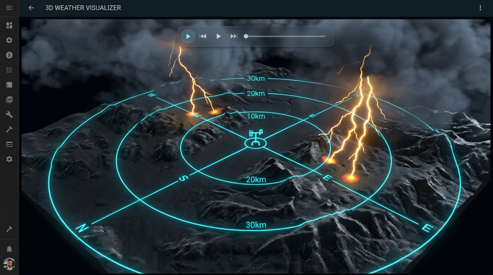

# WeatherFlow Lightning Trilateration Integration

[](https://github.com/hacs/integration)
[](https://github.com/JohNan/homeassistant-weatherflow-lightning-trilateration/actions/workflows/hassfest.yaml)
[](https://github.com/JohNan/homeassistant-weatherflow-lightning-trilateration/actions/workflows/hacs.yaml)
[](https://github.com/JohNan/homeassistant-weatherflow-lightning-trilateration/actions/workflows/lint.yaml)

A native Home Assistant custom integration that connects to the WeatherFlow Tempest WebSocket API, listens for lightning strikes across multiple weather stations, and trilaterates the geographic strike location in real time. Calculated strikes are plotted directly on the Home Assistant map.



---

## Features
- **WebSocket Listener:** Connects directly to the official WeatherFlow WebSocket stream.
- **Auto-Discovery & Options Flow:** Automatically detects configured local weather station IDs from existing official/third-party WeatherFlow integrations. Supports live runtime re-configuration of neighbor station IDs, API access tokens, and distance filter parameters via Home Assistant Integration Options.
- **Advanced Trilateration Engine:** Employs an $N$-station Least-Squares geographic intersection solver for $N \ge 3$ stations. Collects strike events across all configured stations using a 1.5-second delayed synchronization buffer to minimize calculation jitter.
- **Strike Rate Sensor:** Automatically exposes a rolling `strikes/min` sensor entity (`sensor.weatherflow_strike_rate`) calculated dynamically using a 60-second sliding window.
- **Map Visualizations:** Places temporary geolocation markers representing strikes on the map, which automatically disappear after 6 hours.
- **Simulation/Testing Service:** Exposes a custom service to trigger simulated strikes anywhere, allowing end-to-end testing of map markers and dashboard animations.
- **Strike Persistence & Replay:** Persists raw per-station strike observations for 7 days and exposes a `replay_strikes` service to re-run trilateration and backfill missed strikes.
- **3D WebGL Dashboard Card:** Includes an advanced 3D visualizer Lovelace card showcasing:
  - *Real-world 3D Terrain:* Queries Open-Meteo elevation data centered at the primary station coordinates and generates a displaced 3D terrain surface.
  - *Draped Reference Rings:* Places 10km, 20km, and 30km concentric range rings and crosshair compass lines that drape over the terrain bumps.
  - *Interactive Tooltips:* Raycaster-based interactive mouseover tooltips showing station IDs, coordinates, and types.
  - *Auto-Orbit:* Slow idle camera rotation when no user interaction is detected.
  - *Volumetric Bolt Glows:* Blends additive canvas-based particle glow sprites at strike terminal points.
  - *Timeline-Synchronized Heatmap:* Storm path decay tracker preserving recent strikes as shrinking, fading amber indicators matching the virtual timeline playback speed.
  - *Adaptive Day/Night Ambient Shading:* Integrates with the Home Assistant `sun.sun` elevation sensor to scale scene brightness dynamically from bright daylight down to starlit night skies, with an automated fallback to solar radiation telemetry.
  - *WebGL Memory Management:* Implements strict WebGL resource eviction and GPU/CPU memory cleanups to avoid resource leaks during dashboard reloads.
  - *Collision-Resistant Cache:* Automatically segregates Overpass API vector data cache filenames by primary station ID and geocoordinates, pruning stale cache files on write.
- **Robust Connection Handling:** Automatically handles connection drops with exponential backoff retries.

---

## Project Structure

```text
.agents/
└── AGENTS.md            # Coding standards & architectural rules
.github/workflows/
├── hacs.yaml            # HACS repository validation
├── hassfest.yaml        # Home Assistant code structure validation
└── lint.yaml            # Code linting (Ruff/Black/Isort)
custom_components/weatherflow_lightning_trilateration/
├── __init__.py          # Life-cycle hooks, coordinator, and services
├── config_flow.py       # Integration setup flow UI logic & auto-discovery
├── const.py             # Centralized constant definitions
├── dist/
│   └── weatherflow-lightning-card.js   # 3D WebGL Lovelace Custom Card
├── geo_location.py      # GeolocationEvent entities for map plotting
├── manifest.json        # Integration manifest metadata
├── services.yaml        # Field definitions for simulate_* and replay_strikes services
└── translations/
    └── en.json          # English translation strings for Setup UI
hacs.json                # HACS configuration properties
mise.toml                # Developer environment task orchestrator (linting, JSON, and JS syntax checks)
```

---

## Installation & Setup

### Step 1: Install Integration via HACS
1. Open **HACS** in your Home Assistant instance.
2. Click the three dots in the top right corner and select **Custom repositories**.
3. Add the repository URL `https://github.com/JohNan/homeassistant-weatherflow-lightning-trilateration` under the **Integration** category.
4. Click **Download**.
5. Restart Home Assistant.

### Step 2: Configure Custom Lovelace Card (No Manual Files Needed!)
The 3D WebGL Lovelace card is automatically downloaded and served by the integration. To register it:
1. In the Home Assistant UI, navigate to **Settings > Dashboards**.
2. Click the three dots in the top right corner and select **Resources**.
3. Click **Add Resource** and enter:
   - **URL:** `/weatherflow_lightning_trilateration/weatherflow-lightning-card.js`
   - **Resource Type:** `JavaScript Module`

---

## Configuration

### Set Up Integration
1. Navigate to **Settings > Devices & Services**.
2. Click **Add Integration** and search for **WeatherFlow Lightning Trilateration**.
3. Configure the integration options:
   - **Primary Station**: Enter your Tempest station ID (e.g. `172103` from [your station page](https://tempestwx.com/station/172103/)). If none is configured, it will default to the home coordinates from your Home Assistant configuration (`latitude,longitude`).
   - **Neighboring Stations**: Enter a comma-separated list of nearby station IDs (e.g. `81149, 12345`) to use for trilateration.
   - **API Token**: A Personal Access Token. To generate one:
     1. Log in to the [Tempest Web App](https://tempestwx.com/).
     2. Navigate to **Settings > Data Authorizations**.
     3. Click **Create Token** and copy the resulting token string.
4. **How to Find Nearby Stations**:
   - Open the [Tempest Map](https://tempestwx.com/map/) and locate your station.
   - Click on neighboring stations surrounding yours on the map.
   - Extract the station ID from their URLs (for example, in `https://tempestwx.com/station/81149/`, the ID is `81149`).
   - Configure at least 2 neighboring station IDs.
5. Click **Submit** to finalize the setup. The integration will automatically query the WeatherFlow API using your token to resolve coordinates and device IDs for all configured neighboring stations.

### Dashboard Setup
Add the custom card to your dashboard code editor:
```yaml
type: custom:weatherflow-lightning-card
height: 400px
```

---

## Testing & Visual Verification
To visually test the entire mapping and 3D animation stack without waiting for an actual storm:
1. Navigate to the **Developer Tools > Services** tab.
2. Select the service `weatherflow_lightning_trilateration.simulate_strike`.
3. (Optional) Provide target `latitude` and `longitude` values. If omitted, the system generates random coordinates nearby.
4. Click **Call Service**.
5. Check your Home Assistant map card to view the lightning strike marker, and open your custom Lovelace card to view the real-time 3D lightning flash and expanding trilateration ring intersection animation.

---

## Backfilling & Replaying Strikes

Every raw per-station strike observation (`device_id`, `station_id`, `timestamp`, `distance`) is persisted to disk for **7 days**, so trilateration can be re-run later — for example after a fix or a configuration change, or to recover strikes that were missed while the integration was misbehaving.

Use the `weatherflow_lightning_trilateration.replay_strikes` service (**Developer Tools > Actions**):

- **No arguments** — replays the strikes the integration has stored, re-running trilateration over them.
- **`events`** — an explicit list of raw observations to replay, e.g. reconstructed from Home Assistant logs:
  ```yaml
  action: weatherflow_lightning_trilateration.replay_strikes
  data:
    events:
      - { device_id: "408432", timestamp: 1783257210, distance: 1 }
      - { device_id: "102900", timestamp: 1783257209, distance: 12 }
      - { device_id: "214729", timestamp: 1783257208, distance: 10 }
  ```
- **`variance_tolerance`** — max timestamp spread (seconds, default `3`) for grouping strikes from different stations into a single event.
- **`entry_id`** — target a specific integration instance.

Replayed strikes are plotted using their **original timestamps** (so map-marker expiry stays correct, and strikes older than 6 hours are skipped), and duplicate markers are suppressed so the service can be run repeatedly without piling up.

### Reliability & the `unreliable` status
A strike location is only accepted when the computed position actually agrees with the reported distances. After solving, the great-circle distance from the result back to each reporting station is compared against that station's reported distance; if the worst mismatch exceeds `MAX_TRILATERATION_RESIDUAL_KM` (5 km, in `const.py`), the fix is **discarded** and the Trilateration Status sensor reports `unreliable` instead of `success`. This prevents mutually inconsistent readings (coarse/noisy distances, or stations that are too close together) from placing bogus markers on the map.

> **Tip:** Reliable fixes require at least **3 well-separated stations** reporting mutually consistent distances for the same strike. Stations clustered within a few kilometres of each other, or strikes seen by fewer than 3 stations, will not produce a marker.

---

## Troubleshooting & FAQs

### The Integration Icon/Logo is Not Loading
* **Home Assistant Version Requirement**: Local branding folders (where custom integrations serve their own brand icons locally) require **Home Assistant 2026.3** or newer. If you are running an older version, Home Assistant will fall back to querying the Home Assistant Brands CDN (which will return a 404 since this is a custom integration).
* **Caching Issues**: If you are on Home Assistant 2026.3+ and the icon still does not load, the browser has cached the missing brand image. Perform a hard refresh to force reload the brand assets (e.g. `Ctrl + F5` on Windows/Linux or `Cmd + Shift + R` on macOS).

### Custom Element Not Found: weatherflow-lightning-card
* **Automatic Resource Registration**: The integration automatically registers the Lovelace card resource `/weatherflow_lightning_trilateration/weatherflow-lightning-card.js` on startup. If you see this error, ensure the integration has fully loaded and then perform a hard refresh in your browser to reload the resources.

---

## Mathematical Design
The $N$-station trilateration algorithm projects spherical geodetic coordinates to a local Cartesian plane relative to the primary station coordinates (using an Equirectangular projection). Given $N$ weather stations $S_i$ with known coordinates $(x_i, y_i)$ and reported strike distances $d_i$:

1. Formulates the equations of intersection:
   $$(x - x_i)^2 + (y - y_i)^2 = d_i^2$$
2. Linearizes the system by subtracting the equations to obtain a matrix equation of the form:
   $$\mathbf{A}\mathbf{x} = \mathbf{b}$$
3. Solves the overdetermined linear system of equations (when $N \ge 3$) using a Least-Squares optimization method:
   $$\mathbf{x} = (\mathbf{A}^T\mathbf{A})^{-1}\mathbf{A}^T\mathbf{b}$$
4. Transforms the resulting local Cartesian coordinates $(x, y)$ back to spherical geodetic latitude and longitude coordinates.
5. **Validates the fit** by measuring the residual between the reported distances $d_i$ and the great-circle distance from the solved location back to each station $S_i$; solutions whose worst residual exceeds `MAX_TRILATERATION_RESIDUAL_KM` are rejected as `unreliable`.
6. Fires the `weatherflow_strike_calculated` event and updates the Home Assistant map and custom 3D WebGL dashboard card.
